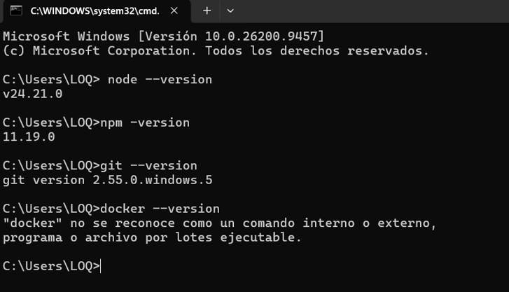
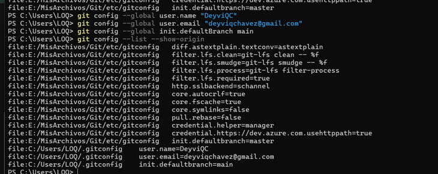

# Guía 01 - Arquitectura de Software

## 1. Nombre completo del estudiante

**Deyvi Aderly Quispe Chavez**

## 2. Breve descripción del curso

El curso de Arquitectura de Software permite conocer los principios, patrones y buenas prácticas para diseñar sistemas de software organizados, mantenibles, escalables y de calidad.

## 3. Expectativas del estudiante respecto al curso

Mis expectativas son aprender a diseñar arquitecturas de software, conocer diferentes patrones arquitectónicos y aplicar buenas prácticas en proyectos reales. También espero mejorar mis conocimientos en el desarrollo de sistemas y comprender cómo organizar correctamente un proyecto de software.

## 4. Nombre completo del docente

**[Escribe aquí el nombre completo de tu docente]**

## 5. Capturas de imágenes

### Paso 1: Verificación de Entorno

### Paso 2: Estructura del Proyecto

